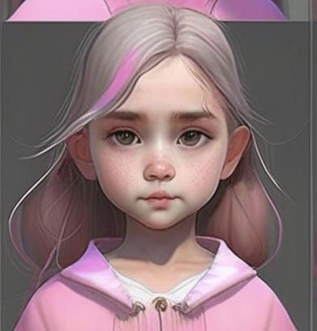
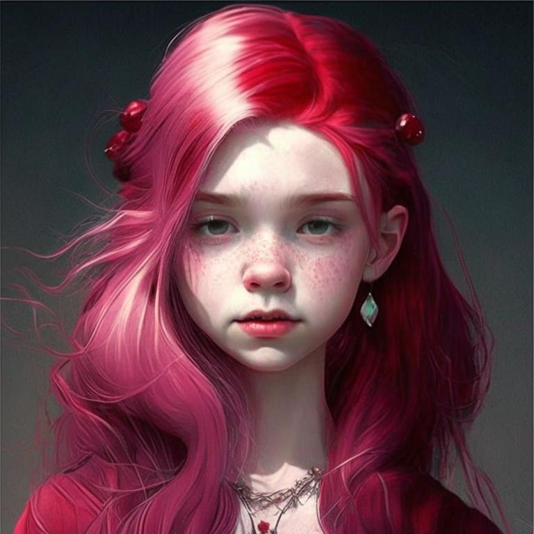
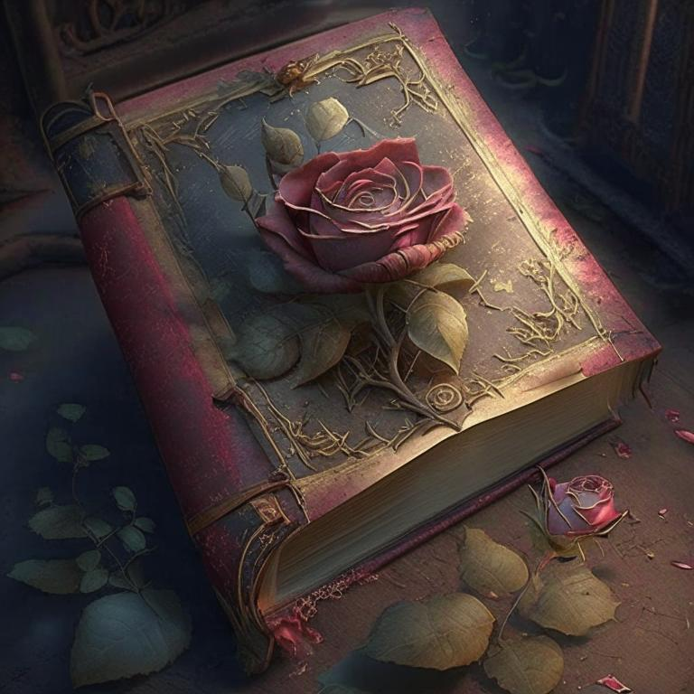

# Пролог

В городе жили две сестры - Варя и Саша. 
Варя была младшей сестрой, ей было всего 6 лет. Но у нее уже была своя яркая индивидуальность. У нее были русые волосы до плеч и серые глаза, которые блестели от любопытства и задора. Щечки у Вари были круглыми и немного пухленькими, что придавало ей очаровательный вид маленькой куколки. Она любила красиво одеваться и носить яркие платья, которые выгодно подчеркивали ее нежную фигурку.
Когда Саша занималась своими делами, Варя обычно играла с куклами, выдумывая для них интересные истории. В то же время, она была очень задиристой и не боялась делать то, что ее старшая сестра считала опасным или неразумным. Ее любопытство и открытость к новым впечатлениям иногда приводили ее в неприятные ситуации, но это не мешало ей продолжать исследовать мир вокруг себя.

У Вари был маленький хомячок и черный шпиц. Хомяка назвали Пушистик, а собаку Чарли, который часто приводил ее в восторг своими трюками и игривостью.

Саша была старшей сестрой, ей было 12 лет. У нее были огненно-красные волосы и серо-зеленые глаза, которые выделялись на фоне яркой рыжей гривы. Она любила плавать и проводила много времени на берегу реки, находя удовольствие в чистой воде и просторах. Ее любимый цвет был черный, и она предпочитала носить черную одежду, которая выгодно подчеркивала ее стройную фигуру.
Саша была очень любопытной и любила проводить эксперименты, вместо того чтобы читать о них в книгах. Она была увлечена наукой и технологиями и часто проводила время, экспериментируя с различными приспособлениями, которые она сама создавала.
Саша также была талантливой музыканткой, и ее инструментом была скрипка. Она играла на ней с большим мастерством и умением, умело создавая глубокие и эмоциональные мелодии, которые заставляли слушателей замирать от восторга.
Саша была умной и самостоятельной девушкой, которая всегда заботилась о своей младшей сестре. Она была ответственной и организованной, всегда знала, что ей нужно делать, чтобы достигнуть своих целей. Саша не была слишком эмоциональной и не проявляла своих чувств так ярко как Варя. Однако, у нее было огромное доброе сердце и она всегда старалась помочь другим.
Саша любила проводить время на природе, исследуя новые места и находя свежие впечатления. Ее любимым местом был лес, где она часто ходила гулять с Чарли.

Вместе Саша и Варя создавали прекрасный тандем, дополняя друг друга своими качествами и интересами. Они были очень близки друг к другу и неразлучны, несмотря на разницу в возрасте и характерах.

Родители девочек много работали, и часто оставляли девочек дома одних. Когда родители возвращались домой, несмотря на усталость, они старались уделить время своим дочерям и поддерживать их увлечения.
 Так случилось и в этот день. Родители ушли на работу оставив заботы по хозяйству и младшей сестрой на Саше. 
Саше нужно было выгулять Чарли, но сегодня Саша выбрала новый маршрут. 
Гуляя с Чарли, Саша увидела необычный старый дом который раньше никогда не замечала. Дом был заброшен и огорожен забором. Ей показалось, что там может быть что-то очень интересное. Саша поспешила домой что бы по быстрее, показать свою находку Варе.
 Младшая сестра была в восторге от возможности выйти на улицу и придумать новую игру вместе с Сашей, «сокровища заброшенного дома».
Преодолев первое препятствие в виде забора, каждая своим уникальным способом девочки оказались в странном дворе. 
Следующее задание было найти вход в старый дом. На удивление Саши входная дверь оказалась открытой. 
Внутри дома девочки обнаружили необычную книгу. Книга была старая и пыльная, но на ее обложке была нарисована красивая роза. 

Когда Саша открыла книгу, страницы были пустыми. Книга сама раскрылась в середине и девочки услышала необычную мелодию. Над пустыми страницами книги они увидели розу.
По мере того как мелодия звучала все громче, роза становилась больше и четче как будто изображение хотело вырваться в мир. Яркая вспышка ослепила, и ошарашила девочек и в этот момент мелодия стихла. Когда к ним вернулась способность видеть девочки уже были не в доме, а на лесной поляне в центре которой росла та самая роза из Книги. 
